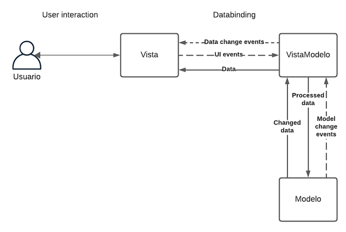

# Diseño arquitectónico de una Aplicación

## Tabla de contenidos
- [Definición del Dominio](#definición-del-dominio)
  - [Elección del Dominio](#elección-del-dominio)
  - [Definición de Principales Funcionalidades](#definición-de-principales-funcionalidades)
- [Identificación de los principales elementos de la arquitectura elegida](#identificación-de-los-principales-elementos-de-la-arquitectura-elegida)
- [Diseño de la Arquitectura](#diseño-de-la-arquitectura)
- [Casos de Uso](#casos-de-uso)
- [Colaboradores](#colaboradores)
- [Descargo de Responsabilidad](#descargo-de-responsabilidad)

## Definición del Dominio
### Elección del Dominio
La aplicación móvil se enfoca en facilitar la gestión y promoción de la adopción y apadrinamiento de animales de una protectora. Destinada para trabajadores de la protectora y usuarios interesados, los objetivos principales incluyen:
- Facilitar adopciones y apadrinamientos.
- Fomentar la participación de voluntarios.
- Proporcionar información actualizada sobre noticias y eventos.
- Optimizar el registro de animales y datos clínicos.
- Agilizar el papeleo administrativo.
- Establecer un canal de comunicación efectivo.
- Mejorar la visibilidad de la protectora y sus actividades.

### Definición de Principales Funcionalidades
- Gestión de Usuarios:
  - Registro de cuentas para roles diversos.
  - Perfiles personalizados para cada rol.
- Explorar Animales:
  - Galería y detalles de animales disponibles.
  - Filtros de búsqueda por especie, estado, etc.
- Perfil Individual Animal:
  - Detalles completos del animal.
  - Opciones para apadrinar o adoptar.
- Registro Clínico (para Trabajadores):
  - Acceso exclusivo para información médica.
  - Historial de tratamientos, medicamentos y diagnósticos.
- Gestión de Eventos y Noticias:
  - Publicación y actualización de eventos y noticias.
- Comunicación entre Roles:
  - Mensajería interna y notificaciones.
- Administración de Facturas (para Dueño/a):
  - Visualización y descarga de facturas asociadas.
- Niveles de Acceso para Voluntarios:
  - Distintos permisos basados en responsabilidades.
- Proceso de Apadrinamiento y Adopción:
  - Flujo guiado para solicitudes.
- Calendario de Disponibilidad de Voluntarios:
  - Asignación a tareas según horarios.
- Donaciones:
  - Sistema de donaciones y pagos en línea.
- Idiomas Adicionales:
  - Cambio de idioma de la aplicación.

## Identificación de los principales elementos de la arquitectura elegida
- Modelo-Vista-VistaModelo (MVVM)
  - Modelo (Backend):
    - Capa de datos y lógica de negocio.
    - Gestión de usuarios, información animal, registros clínicos, eventos y comunicación.
  - Vista (Frontend):
    - Interfaz de usuario.
    - Componentes visuales para explorar animales, perfiles, eventos, etc.
  - VistaModelo (Intermediario):
    - Gestiona interacciones, procesa solicitudes y controla la lógica de flujo.
    - Encargado de lógica de gestión de usuarios, búsqueda de animales, comunicación entre roles, apadrinamiento y más.

## Diseño de la Arquitectura

## Casos de Uso
- Caso de Uso 1: Registro de un Nuevo Usuario
- Caso de Uso 2: Búsqueda y Visualización de Animales para Adopción

## Colaboradores
- [Selene](https://github.com/SeleneGonzalezCurbelo)
- [Mele13](https://github.com/mele13)

## Descargo de Responsabilidad
Este repositorio se desarrolla exclusivamente con fines educativos como parte de un curso universitario.
