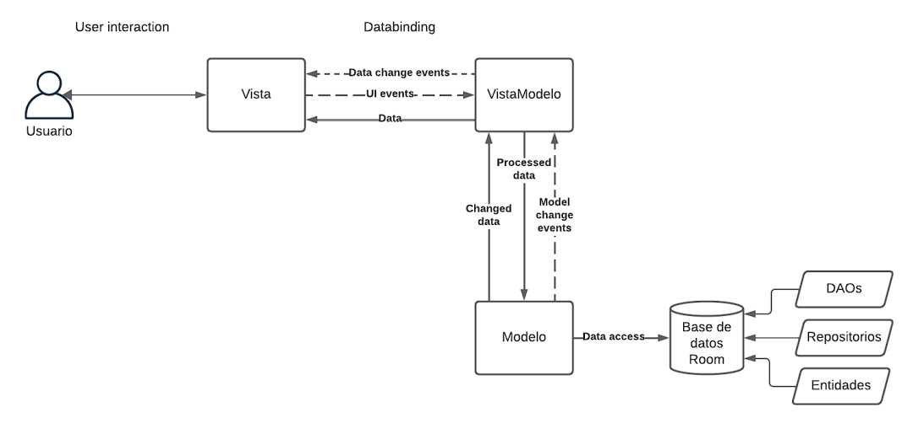

# Diseño de la Base de Datos

## Tabla de contenidos
- [Introducción](#introducción)
- [Análisis de modelos y componentes de persistencia](#análisis-de-modelos-y-componentes-de-persistencia)
  - [Modelos](#modelos)
  - [Componentes](#componentes)
- [Tecnología de Base de Datos](#tecnología-de-base-de-datos)
- [Integración de la Lógica de Persistencia](#integración-de-la-lógica-de-persistencia)
- [Diagrama](#diagrama)
- [Preparación para el Futuro](#preparación-para-el-futuro)
- [Colaboradores](#colaboradores)
- [Descargo de Responsabilidad](#descargo-de-responsabilidad)
 
## Introducción
Este informe se centra en los pasos clave para diseñar y seleccionar la base de datos adecuada para un proyecto final. La elección y diseño de la base de datos impactan significativamente en el funcionamiento, rendimiento y escalabilidad del proyecto en su conjunto.

## Análisis de modelos y componentes de persistencia
### Modelos
- Usuario: Representa a los usuarios de la aplicación con atributos como nombre, correo electrónico, contraseña, etc.
- Animal: Modelo central que representa a los animales disponibles para adopción con atributos detallados.
- Evento/Noticia: Modelos separados según la gestión de eventos y noticias relacionadas con la protectora.
- Petición de Acogida/Apadrinamiento: Modelos para gestionar solicitudes relacionadas con animales.
- Notificación: Informa a los usuarios sobre eventos importantes o actualizaciones relacionadas con los animales.
- Pago: Registra transacciones financieras según la gestión de apadrinamiento o donaciones.

### Componentes
- Patrón DAO: Separación de la lógica de acceso a la base de datos de la lógica de negocio para modularidad y mantenimiento.
- Entidades: Representan la estructura de datos y aseguran la integridad de los datos.
- Repositorios: Abstraen la complejidad de la interacción con la base de datos y facilitan el acceso coherente a los datos.

## Tecnología de Base de Datos
Hemos seleccionado Room como la tecnología principal para la base de datos de nuestra aplicación. Esta elección se basa en su abstracción sólida, reducción de código repetitivo, integración con Kotlin y capa adicional de seguridad.

## Integración de la Lógica de Persistencia
- Entidades: AnimalEntity y UserEntity.
- DAOs: AnimalDao y UserDao.
- Repositorios: AnimalRepository y UserRepository.

## Diagrama

## Preparación para el Futuro
Anticipamos desafíos si se cambia el motor de base de datos. Para minimizar el impacto, aplicamos buenas prácticas, incluyendo abstracción de la capa de persistencia, uso de interfaces y abstracciones, pruebas automatizadas y documentación detallada.

## Colaboradores
- [Selene](https://github.com/SeleneGonzalezCurbelo)
- [Mele13](https://github.com/mele13)

## Descargo de Responsabilidad
Este repositorio se desarrolla exclusivamente con fines educativos como parte de un curso universitario.
